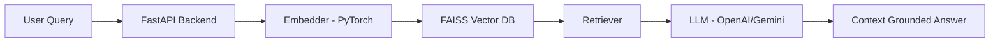

# 📚 RAG-Based LLM Powered Query–Retrieval System

A **Retrieval-Augmented Generation (RAG)** system capable of extracting, embedding, retrieving, and answering questions from multi-format documents with **context-grounded, concise, and reliable responses**.

This system integrates **FastAPI, PyTorch, FAISS, LangChain, and OpenAI/Gemini LLMs**, with performance optimization through **async concurrency, batching, structured logging, authentication, and multi-API key failover handling**.

---

## Features

- Intelligent retrieval using FAISS vector similarity search  
- LLM reasoning with grounded contextual responses  
- Supports PDF, DOC, TXT, and mixed structured/unstructured data  
- Optimized with async execution & batching  
- Secure APIs with logging and API key rotation  
- Postman validated & reliability focused  

---

## Architecture


---

## Quick Start
1. **Install dependencies:**
   ```bash
   pip install -r requirements.txt
   ```
2. **Set environment variables:**
   - Copy `.env.example` to `.env` and fill in your API keys (OpenAI, Gemini, etc.)
3. **Run the server:**
   ```bash
   uvicorn app.main:app --reload
   ```
4. **API Endpoints:**
   - `POST /api/v1/hackrx/run` — Submit document URL and questions
   - `GET /api/v1/health` — Health check

## Technologies Used
- Python, FastAPI, Pydantic
- PyTorch, SentenceTransformers
- FAISS (vector search)
- OpenAI API, Google Gemini API
- LangChain, LangSmith
- pdfplumber, python-docx, BeautifulSoup, pytesseract (OCR)


## License
Apache 2.0

## Images Included

The repository includes the following images located in the `images/` folder:


